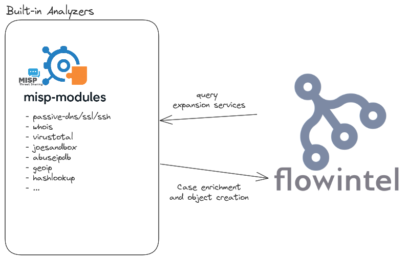

# Analyzers

An analyzer is a connected tool which will receive and send back data to flowintel.

After a selection in notes, send this to an analyzer, here it's [misp-modules](https://github.com/MISP/misp-modules) that is used as analyzer. You'll be redirect to misp-modules main page with pre-filled fields. After a research, results can be send to flowintel and populate notes with them.

# Format

### From flowintel

Array of string. Each element is a new line of `Note selected`. (see `/analyzer` in flowintel)

*<u>example</u>* `["8.8.8.8", "127.0.0.1",...]` or `["circl.lu", "google.com",...]`

### To flowintel

Flowintel receive results from analyzer by the way of the api.

For more info see [here](docs/api.md#analyzer)
