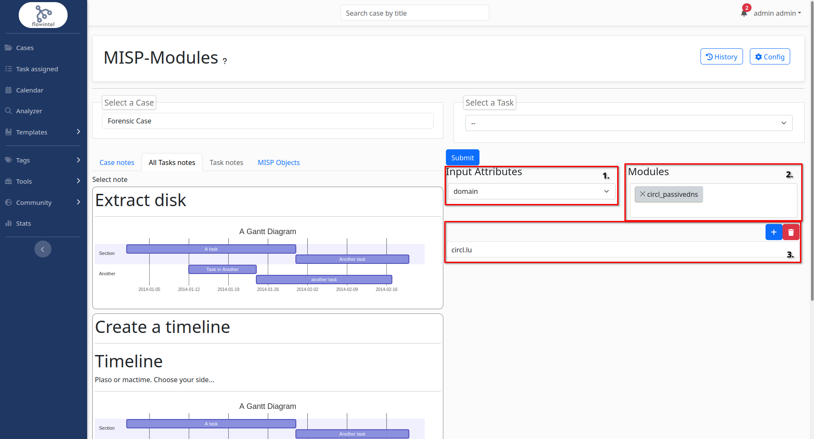
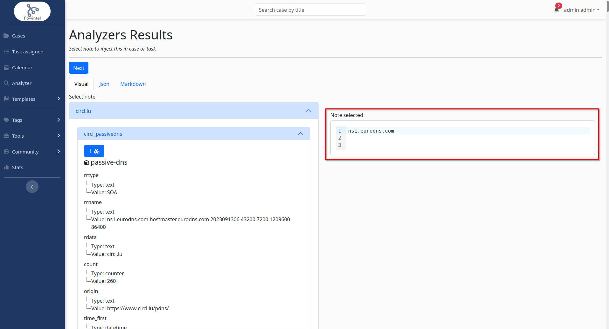
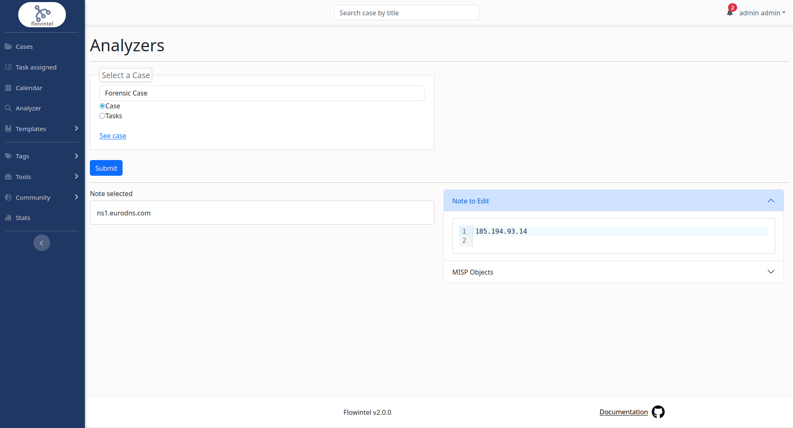

# Analyzers

An analyzer is a connected tool which will receive and send back data to flowintel.

Actually, only [misp-modules](https://github.com/MISP/misp-modules) is integrated.

## Usage step-by-step
1. Select an input attribute
2. Select modules to run
3. Enter multiple entry
4. Submit

5. After review, put selection in the dedicated area
6. Next

7. Choose a case
8. Edit note or create a new MISP object
9. Submit

