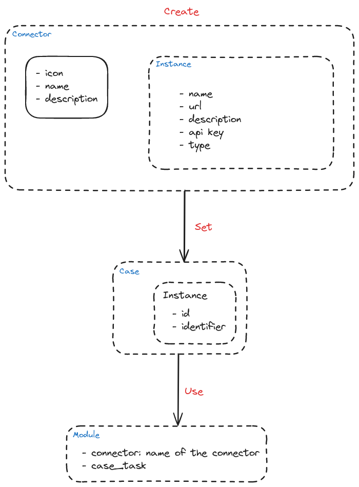

# Connectors

A connector represent the tool you want to connect to, it will contain instances which contains information to connect and use the tool.

An instance is usable by multiple cases but in each case an identifier is to be defined manually or will be defined by the module that will use the instance.



## Modules

A module is a script that use flowintel data and send it to an other tool in a compatible 

### Create your own module

You can find an example [here](https://github.com/flowintel/flowintel/blob/main/app/modules/send_to/misp_event.py)

You need at least to fill those two things:

```python
module_config = {
    "connector": "",    # type of connector to use, can be removed 
    "case_task": ""     # 'case' or 'task'
}

def handler(instance, case, user):
    """
    instance: Info about the connector like name, api_key...
    case: Dictionary with all case info, including all its tasks
    user: Info on the user who use the module
    """
    # Write your code here
    # ...
```

Save your module in the directory that correspond to the type of your module:

`flowintel/app/modules`
