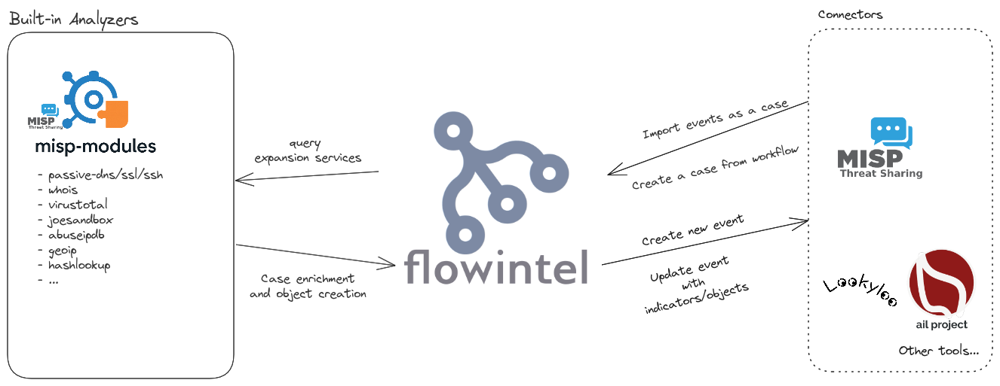

# Connectors vs Analyzers

Connectors and Analyzers are not the same but have some similarities that can be confusing.

Analyzers receive data from flowintel and can send data to flowintel to enrich notes of cases or tasks.

Connectors can only receive data from flowintel. In the case of MISP, this will result in the creation of an event with a flowintel-cm-case object for a case and a flowintel-cm-task object for a task.
